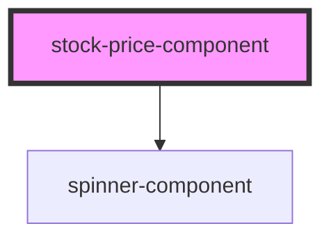

# stock-price-component

<!-- Auto Generated Below -->

## Properties

| Property      | Attribute      | Description | Type         | Default     |
| ------------- | -------------- | ----------- | ------------ | ----------- |
| `apiService`  | --             |             | `ApiService` | `undefined` |
| `stockSymbol` | `stock-symbol` |             | `string`     | `undefined` |

## Dependencies

### Depends on

- [spinner-component](../spinner-component)

### Graph

----------------------------------------------

*Built with [StencilJS](https://stenciljs.com/)*
